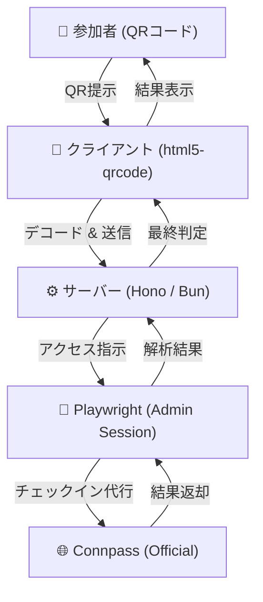

# Connpass Reception

connpassのイベント受付をセルフ化するための、Hono（Cloudflare Workers/Node.js）ベースのWebアプリケーションです。

## 🚀 特徴
* **マルチデバイス対応QR読み取り**: [html5-qrcode](https://github.com/mebjas/html5-qrcode) を採用し、様々なブラウザやデバイスでの安定したスキャンを実現。
* **エッジ対応**: [Hono](https://hono.dev/) フレームワークにより、Cloudflare Workers 等の低レイテンシ環境で動作。
* **セッションプロキシ**: 管理者ログイン済みのCookieをサーバー側で保持し、参加者の代わりに受付URLへアクセス。

## 🛠 技術スタック
* **Framework**: [Hono](https://hono.dev/)
* **Frontend Library**: [html5-qrcode](https://github.com/mebjas/html5-qrcode)
* **Backend Automation**: [Playwright](https://playwright.dev/)
* **Runtime**: Cloudflare Workers / Node.js / Bun

## 🏗 システム構成



## 📋 受付フロー

1.  **管理者ログイン**:
    サーバー起動時にブラウザが立ち上がるため、connpassの管理者アカウントでログインを完了させます（セッションは `./playwright-profile` に保存されます）。
2.  **QRスキャン (Client)**:
    `html5-qrcode` を用いて、参加者が提示した `https://connpass.com/checkin/code/...` を読み取ります。
3.  **プロキシ実行 (Server)**:
    読み取ったURLをエンドポイント `POST /api/checkin` へ送信。サーバーサイドのPlaywrightがそのURLを開き、管理者の代わりに受付処理を代行します。
4.  **結果判定**:
    画面上の「受付を完了しました」等のメッセージを解析し、成功（すでに受付済みを含む）をクライアントに返却します。

## 💻 セットアップ

### 1. 依存関係のインストール
```bash
bun install
```

### 2. 起動
```bash
bun run dev
```


## ⚠️ 注意点
* **セキュリティ**: 受付URLが `https://connpass.com/` で始まっているか、サーバー側で厳密にバリデーションしています。
* **カメラ権限**: ブラウザのカメラ利用許可が必要です。HTTPS環境（または localhost）での実行を推奨します。
* **セッション維持**: Connpassのセッション有効期限に注意し、ログインが切れた場合は再度サーバー側でログイン操作を行ってください。
